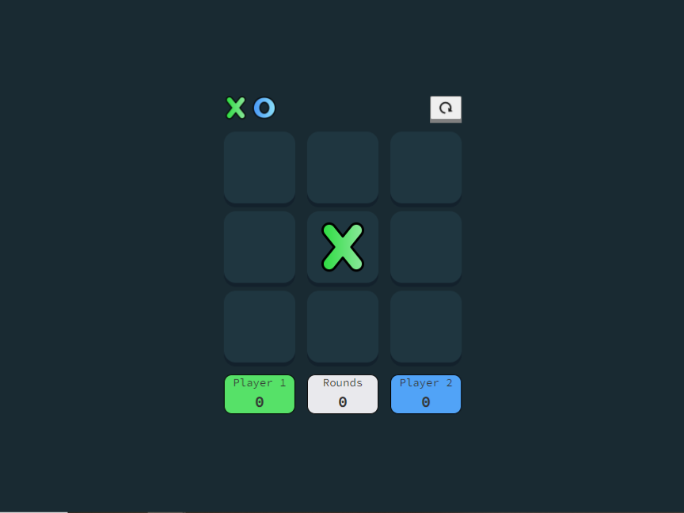
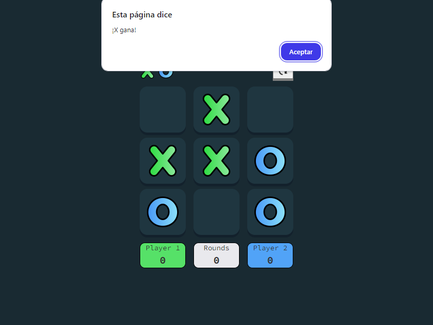
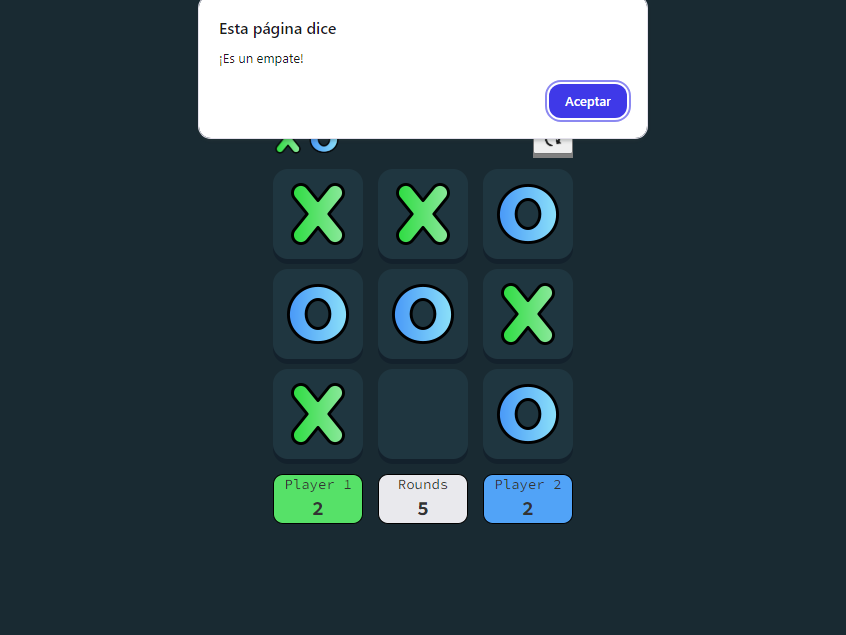

<h1>Tres en raya</h1>

  

 
Ejercicio de clase: 
 

  

 

En este preoyecto replico un tres en raya funcional con las tecnologias de html,css, javaScript.  
Donde dos usuarios pueden enfrentarse para demostrar su habilidad.   
Contiene 3 contadores donde se muestra el resultado actual player1, rounds, player2.   
Por cada ganador o empate se imprimira una alaert en la pantalla.  
Tambien tiene un boton de restart.   
Es responsive. 🧮
 

<h3>ALGUNAS IMAGENES </h3>   
<h4 align= "left"> 🔵 Tablero </h4>   
     
  <h4 align= "left"> 🔵 Mensaje cuando un jugador gana </h4>   
    
  <h4 align= "left"> 🔵 Mensaje de empate y marcadores </h4>   
   

  
 
 
<h6>Gracias por visitar el repo 🥳 </h6>
